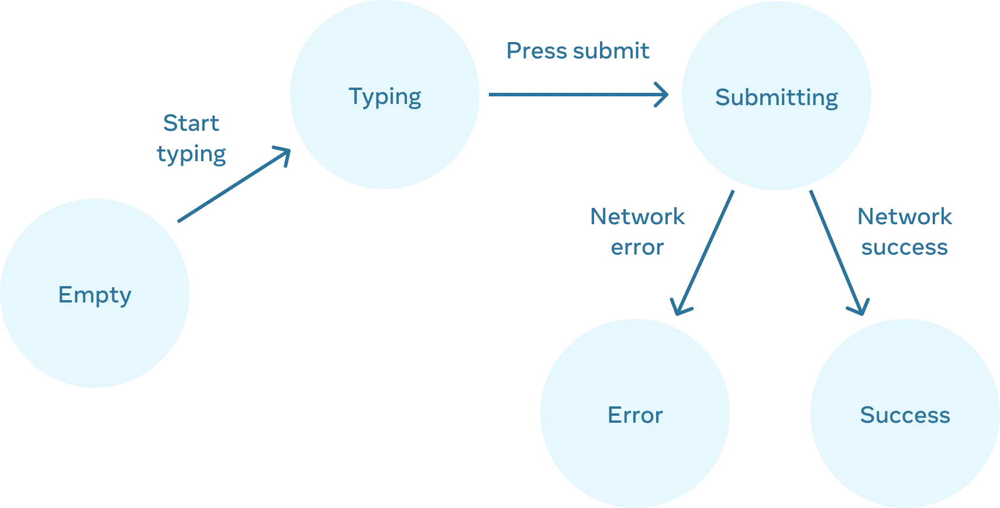

# Managing State

## 1. State를 사용해 Input 다루기

### 1-1. 선언형 UI와 명령형 UI 비교

#### 명령형 UI

> 직접 UI 를 조작하는 방식

- 각 요소의 상태를 개별적으로 변경
- 복잡한 시스템에서 관리하기 어려움
- 직접 DOM 을 조작하는 방식

#### 선언형 UI

> React 접근 방식

- 각 시각적 상태를 state 로 표현
- state 변경에 따라 자동으로 UI 업데이트
- 코드가 예측할 수 있고 유지 보수하기 쉬움

### 1-2. UI를 선언적인 방식으로 생각하기

#### 1. 컴포넌트의 시각적 상태 확인

- 비어있는 상태
- 입력 중인 상태
- 제출 중인 상태
- 성공 상태
- 에러 상태

#### 2. state 변화를 트리거하는 요소 파악



- 사용자 입력
- 네트워크 응답

#### 3. useState로 state 모델링

> 각 시각적 상태를 state 로 표현

- UI 의 각 상태를 독립적인 state 로 표현
- 상태의 의미가 명확해야 함
- 상태 간의 관계를 고려하여 설계

```tsx
const [answer, setAnswer] = useState('');
const [error, setError] = useState(null);
const [status, setStatus] = useState('typing');
```

#### 4. 불필요한 state 제거

> state 역설 확인하기

- `isTyping` 과 `isSubmitting` 이 동시에 `true` 일 수 없음
- state 가 충분히 제한되지 않았음을 의미
- 두 boolean 에 대한 네 가지 조합이 있지만 유효한 state 는 세 개뿐
- 불가능한 state 를 제거하기 위해 세 가지 값 'typing', 'submitting', 'success' 을 하나의 status 로 통합

```tsx
// 불필요한 state
const [isTyping, setIsTyping] = useState(false);
const [isSubmitting, setIsSubmitting] = useState(false);

// status 하나로 통합
const [status, setStatus] = useState('typing'); // 'typing' | 'submitting' | 'success'
```

> 중복 정보 확인하기

- `isEmpty` 와 `isTyping` 을 각각의 state 변수로 분리하면 싱크가 맞지 않거나 버그가 발생할 수 있음
- `isEmpty` 를 지우고 `answer.length === 0` 으로 체크할 수 있음

> 파생된 정보 확인하기

- `isError` 는 `error !== null` 로 확인할 수 있기 때문에 필요하지 않음

#### 5. 이벤트 핸들러 연결

- state 업데이트 로직 구현
- 사용자 입력 처리
- 비동기 작업 처리

## 2. State 구조 선택하기

## 4. 컴포넌트 간 State 공유하기
